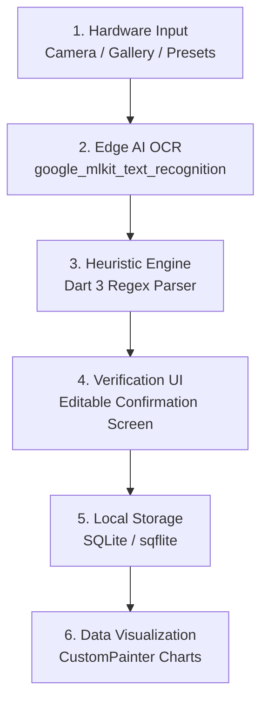

# System Architecture

## Kiến trúc 6 tầng (6-Layer Architecture)

Ứng dụng tuân thủ kiến trúc phân tầng rõ ràng, đảm bảo tính tách biệt, dễ bảo trì và mở rộng:

### Chi tiết các tầng

| Tầng | Tên tầng | Trách nhiệm | Công nghệ sử dụng |
| :--- | :--- | :--- | :--- |
| **1** | Hardware Input | Thu thập hình ảnh từ Camera, Thư viện ảnh, hoặc Mẫu thử nghiệm | `image_picker`, `MockupReceipt` |
| **2** | Edge AI OCR | Nhận diện ký tự quang học 100% offline trên thiết bị | `google_mlkit_text_recognition` |
| **3** | Heuristic Engine | Phân tích text thô, trích xuất số tiền, ngày giờ, đối tác, danh mục | `RegExp` Dart 3, Pattern Matching |
| **4** | Verification UI | Cho phép người dùng trực quan kiểm tra, sửa đổi trước khi lưu | Flutter Form, Material 3 Widgets |
| **5** | Local Storage | Lưu trữ dữ liệu giao dịch an toàn và nhanh chóng trên thiết bị | `sqflite`, `sqflite_common_ffi` |
| **6** | Data Visualization | Hiển thị biểu đồ phân tích thống kê chi tiêu trực quan | Flutter `CustomPainter` (Pie & Bar) |

## Dữ liệu và Luồng xử lý (Data Flow)

1. **Input:** `InputImage` (từ file path hoặc camera bytes).
2. **ML Kit:** Trả về `RecognizedText` bao gồm các `TextBlock` và `TextLine`.
3. **Parser:** Nhận chuỗi `rawText`, chạy qua các bộ lọc biểu thức chính quy (Regex Pipeline), trả về `ParsedResult`.
4. **Verification UI:** Khởi tạo `TextEditingController` với các giá trị từ `ParsedResult`.
5. **Database:** Lưu object `TransactionModel` vào SQLite database table `transactions`.
6. **Analytics:** Truy vấn `DatabaseService.instance.getCategoryBreakdown()` và render bằng `CustomPainter`.
